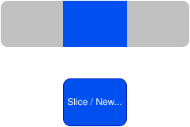

<!--
title: "Reading and Writing (structured) Memory using Java's Foreign Function & Memory API"
author: "Nikki Tschierske, Jakob Jungherr"
footer: "Reading and Writing (structured) Memory using Java's Foreign Function & Memory API" # TODO
paginate: true
theme: default
class:
  - invert
-->

# FFM: Reading & Writing Structured Memory

<!--
- Hi, im Rahmen unserer Seminararbeit haben wir uns mit der Java Foreign Function & Memory API mit einem Schwerpunkt auf Lesen und Schreiben von strukturiertem Speicher auseinander gesetzt.
- Kurzer Hinweis an dieser Stelle: Die Folien sind auf Englisch, da auch unsere Seminararbeit auf Englisch ist, wir werden den Vortrag aber auf Deutsch halten.
-->

---

<!--
_header: Structure
-->

# Structure & Introduction

- ### **Introduction**
- MemorySegments
- MemoryLayouts
- Proof of Concept
- Conclusion

<!--
- Ich verliere gleich 2-3 Sätze über unsere Methodik und dann werden wir uns gemeinsam anschauen, wie die FFM API Zugriff auf Foreign Memory ermöglicht.
- Dafür werden wir uns im Speziellen MemorySegments und MemoryLayouts angucken, sowie unser Proof of Concept zum Thema betrachten.
- Aber erstmal ein wenig zu unserer Methodik;
  - Wir haben angefangen erstmal die JEPs, OpenJDK Dokumentation sowie die Oracle Dokumentation durchzulesen. 
  - Von da aus sind wir meist noch auf weitere Quellen gestoßen.
  - Einige Recherchegebiete haben sich auch beim basteln des POCs ergeben.
-->

---

<!--
_header: Structure
-->

# Structure

- Introduction
- ### **MemorySegments**
- MemoryLayouts
- Proof of Concept
- Conclusion

<!--
- Da alle Anwesenden zumindest einmal mit der FFM API gearbeitet haben, steigen wir direkt ins Thema ein.
- Es ist allen bekannt, dass mit die FFM API das Lesen & Schreiben von foreign memory sowie das Aufrufen von nativen Funktionen ermöglicht.
- Ein zentraler Baustein sind dabei MemorySegments.
-->

---

<!--
header: Memory Segments
-->

# Memory Segments

Provide:
- A unified type-safe abstraction over on- and off-heap memory
- Spatial and temporal guarantees

<!--
- MemorySegments stellen eine einheitliche, Typensichere Abstraktion über on- und off-heap Speicher bereit
- Dabei bieten sie auch räumliche und zeitliche Garantien, das erkläre ich aber gleich auch nochmal genauer.
-->

---

# Memory Segments - Fat pointer

Combination of (base) pointer & Metadata (length etc.)

Wrap:
- On-heap
- Off-heap
- Function pointers

Basically anything pointer

<!--
- MemorySegments sind fat Pointer und kapseln on- und off-heap Speicher sowie Funktionspointer
- Fat pointer bedeuted, dass diese zusätzlich zum (base) Pointer noch Metadaten wie die Länge, Lifetime Scope (Geltungsbereich), Thread Zugriffskontrolle und ähnliches speichern.
- Durch die gespeicherte Länge werden out-of-bounds Speicherzugriffe verhindert, indem alle Lese- oder Schreibzugriffe geprüft werden.
-->

---

# Arena
- Implementor of `SegmentAllocator`
- Controls lifecycle of segments
  - Global / Automatic / Shared / Confined

<!--
- MemorySegments können durch einen Implementierer des SegmentAllocator Interfaces allocated werden.
- Arena ist dabei der Hauptimplementierer des Interfaces und kontrolliert den Geltungsbereich von MemorySegments die in ihr allocated sind.
- Wenn eine Arena geschlossen wird, wird sämtlicher Speicher der in ihr allocated wurde, freigegeben.
- Es gibt dabei verschiedene Arenas mit unterschiedlichen Eigenschaften:
-->

---

# Arena - Global
- Exists and is open for the duration of the Application
- Accessible from everywhere
- Does not deallocate during Runtime
- Cannot be closed explicitely (attempt throws exception)

<!--
Global Arena: Existiert und ist offen für Lebensdauer Anwendung.
  - Von überall accessible und kann nicht explizit geschlossen werden (Exception).
  - Speicher wird während Runtime nicht freigegeben
-->

---

# Arena - Automatic
- Is open as long as it and MemorySegments allocated within it
are deemed accessible by the GC
- Shared access by multiple threads
- Cannot be closed explicitely (attempt throws exception)

<!--
- Automatic Arena; Lebt so lange, wie der Garbage Collector sie und MemorySegments die in ihr allocated wurden als erreichbar ansieht.
- Kann wie die globale Arena nicht explizit geschlossen werden
-->

---

# Arena - Shared
- Shared access by multiple threads
- Can be closed explicitely by any thread

<!--
- Shared Arena ist eine simple Arena, auf die von mehreren Threads aus zugegriffen und geschlossen werden kann. 
-->

---

# Arena - Confined
- Has an owner thread
- MemorySegments allocated within only accessible by owner thread
- Can be closed explicitely by owner thread only

<!--
- Die Confined Arena hat einen Besitzer-Thread und Zugriff auf sie ist nur von diesem Thread aus möglich und sie kann nur von dort aus geschlossen werden.
-->

---

# Arena - Confined

```java
try (Arena arena = Arena.ofConfined()) {
    MemorySegment seg = arena.allocate(4); // Enough for an int
    seg.set(ValueLayout.JAVA_INT, 0, 42);
    int value = seg.get(ValueLayout.JAVA_INT, 0); // value = 42
}
```

<!--
- Arenas implementieren Autoclosable und können daher gut mit try-with-resources Blöcken verwendet werden
- Confined Arena wird erstellt
- MemorySegment mit Platz für 4 Byte wird allocated
- Ein int wird reingeschrieben
- Der int wird wieder ausgelesen
- try() block endet, memory wird deallocated
-->

---

# Arena - Shared

```java
Arena arena = Arena.ofShared();
MemorySegment seg = arena.allocate(4);
seg.set(ValueLayout.JAVA_INT, 0, 42);
int value = seg.get(ValueLayout.JAVA_INT, 0);
arena.close(); // explicit close; deallocates memory for all threads
// Closing a shared arena is however an expensive operation
```

<!--
- Hier machen wir mit der shared Arena die gleichen Operationen wie eben, nur ohne den try-with-resources
- try-with-resources kann hier natürlich aber auch benutzt werden.
- Das schließen einer shared Arena involviert Synchronisationsoperationen und ist etwas aufwendiger bzw. teurer
-->

---

# Slices & Read-only

- MemorySegments can be sliced
- MemorySegments can be made read-only



<!--
- MemorySegments können auch in Slices unterteilt werden
- Slices sind neue MemorySegments die ihren zugrundeliegenden Speicher mit dem ursprünglichen Segment teilen
- Diese neuen MemorySegments haben lediglich einen anderen base Pointer und Länge, der lifetime scope ändert sich nicht.
- Segments können auch read-only markiert werden, ein Slice von diesem ist dann auch read-only, allerdings nur innerhalb der JVM.
- (Optional; Warum?)
-->

---

# Slices & Read-only: Code example

```java
try (Arena a = Arena.ofConfined()) {
    MemorySegment s  = a.allocate(12);            // 3 ints
    s.set(ValueLayout.JAVA_INT, 4, 20);           // Middle int, byte offset
    MemorySegment ro = s.asSlice(4, 4).asReadOnly();   // slice + RO
    System.out.println(ro.get(ValueLayout.JAVA_INT, 0)); // 20
    s.set(ValueLayout.JAVA_INT, 4, 42);          // Set int to 42
    System.out.println(ro.get(ValueLayout.JAVA_INT, 0)); // 42
    ro.set(ValueLayout.JAVA_INT, 0, 99);  // throws (read-only)
}
```

<!--
- Beispiel erklären, kurz !!
-->

---

# Native interop
- On-heap segments cannot be passed to native code
- MemorySegments wrap pointers returned from native code

<!--
- On-heap MemorySegments können nicht an nativen Code übergeben werden
- MemorySegments kapseln auch Pointer die von nativem Code zurückgegeben werden
- Diese haben aber eine Länge von 0 da die Runtime nicht wissen kann wie groß der zugrundeliegende Speicher ist.
-->

---

# Native interop - Zero-length MemorySegments
- Have to be reinterpreted

<!-- Example from our demo -->
```java
cityNameSegment.reinterpret(Long.MAX_VALUE).getString(0)
```

<!--
- Um dann mit diesen MemorySegments zu arbeiten, muss man diese erst re-interpretieren, also ein neues Segment mit dem gleichen Base Pointer aber anderer Länge erzeugen.
- Bei einem NULL-Terminated String zum Beispiel kann man einfach rüberlaufen und den NULL-Terminator finden.
- Bei einem Struct kennt man die Größe und Layout und kann daher einfacher re-interpretieren.
- reinterpret ist eine Zugriffsbeschränkte Methode, der Zugriff muss beim Start der Anwendung explizit freigegeben werden.

-->

---

# Native interop - Function pointers
- Zero-length MemorySegment
  - Can be passed to native code accepting function pointers
  - MethodHandle to call

<!--
- MemorySegments kapseln auch Funktionspointer, damit diese auch an nativen Code übergeben werden können
- Um Funktionen dann aber aufzurufen muss das MemorySegment in eine MethodHandle umgewandelt werden
-->

---

<!--
_header: Structure
-->

# Structure

- Introduction
- MemorySegments
- ### **MemoryLayouts**
- Proof of Concept
- Conclusion

---

# Memory Layouts
<!--
header: MemoryLayouts
-->

<!--
- jetzt bekannt wie mit MemorySegments
  - allocated
  - gelesen
  - geschrieben
  werden kann
-> Werkzeug zum Beschreiben der Struktur des Speichers 
-> MemoryLayouts

- denn Speicher selten einfach nur ein Int, wie in den Folien bisher gezeigt, sondern komplizierter
- MemoryLayouts erlauben es Struktur, inklusive
    - Größe
    - Alignment
    - Anordnung von Objekten
- zu beschreiben -> einfacheren, strukturierten Zugriff auf den Speicher.
- sind nur eine Karte für MemorySegments! Speicherzugriffe weiterhin über MemorySegment
- mehrere Subtypen:
-->

Describe the memory's structure:
- size
- alignment
- data arrangement within a segment

-> Allow easy access to structured memory 

---
<!--
Zuerst - ValueLayouts:
- eine der einfachsten MemoryLayouts
- beschreibt Struktur von simplen Datentypen, wie Integern und Doubles (oder auch Adressen)

- JAVA_INT beschreibt also Größe und Alignment von einem Java int (4 bytes groß, 4 bytes aligned)

- um deutlich zu machen, dass es sich hier um ValueLayouts handelt, haben wir bisher das 'ValueLayout.' immer stehen gelassen.
(SWITCH)
-->

# ValueLayout
Describes memory of basic data types:
```java
MemoryLayout integerLayout = ValueLayout.JAVA_INT;


MemoryLayout doubleLayout = ValueLayout.JAVA_DOUBLE;
```

---

# ValueLayout

<!-- 
In den folgenden Folien, werden wir aber so tun als würden wir die ValueLayouts direkt importen, um die Folien ein bisschen lesbarer zu halten

kurzer Einschub, bevor wir über andere Typen von MemoryLayouts reden:
Wie kann man MemoryLayouts benutzen?
-->
Describes memory of basic data types:
```java
MemoryLayout integerLayout = JAVA_INT;


MemoryLayout doubleLayout = JAVA_DOUBLE;
```

---
# Memory Allocation with MemoryLayouts
<!--
Hier ein Beispiel, was mit einem MemoryLayout ein MemorySegment allocated.
-> sehr ähnlich zu schon gezeigtem Code.

Allocated automatisch Speicher für einen Java Integer im Segment
-->
```java
try (Arena arena = Arena.ofConfined()) {

    ...

    MemorySegment segment = arena.allocate(JAVA_INT);

    ...
}
```

---

# PaddingLayout
<!--
Der nächste, relativ simple, subtyp von MemoryLayouts:
PaddingLayout

- Beschreibt simples padding, also ungenutzten Speicher
- Vor allem als Sublayout in den folgenden, komplizierteren MemoryLayouts gebraucht
-->
Describes padding of `n` bytes:
```java
MemoryLayout padding = MemoryLayout.paddingLayout(3);
```

---

# StructLayout
<!--
Nun zu komplizierteren MemoryLayouts:
StructLayouts

Name sagt es schon: beschreiben Speicher, wie er für ein C struct genutzt wird.

Hier beispiel C struct: ein Item mit id und value

Darunter Java Beispiel Code um Speicher dafür zu allocaten, ohne StructLayouts zu benutzen:
- benötigte Größe bestimmen
- entsprechendes Alignment bestimmen
- manuelles allocaten
-->

C:
```c
struct Item {
    int32_t id;
    float value;
};
```

Java:
```java
var size = JAVA_INT.byteSize() + JAVA_FLOAT.byteSize();
var alignment = JAVA_INT.byteAlignment();
MemorySegment segment = Arena.ofAuto().allocate(size, alignment);
```

---
<!--
Hier jetzt das gleiche C struct und Beispiel Java Code zum allocaten des Speichers hierfür mit dem StructLayout

- bessere Lesbarkeit, starke Ähnlichkeit zum C Code -> Maintainability
- withName später noch genauer, aktuell auch einfach Lesbarkeit
- allocate nimmt dann nur noch das structLayout, alignment ist automatisch bekannt

Wichtig zu erwähnen: StructLayouts achten nicht automatisch auf alignment und wenn Padding benötigt wird, muss das auf der FFM Seite mit PaddingLayout manuell realisiert werden.
-->

# StructLayout cont'd

C:
```c
struct Item {
    int32_t id;
    float value;
};
```

Java:
```java
MemoryLayout structLayout = MemoryLayout.structLayout(
    JAVA_INT.withName("id"),
    JAVA_FLOAT.withName("value")
);
Arena.ofAuto().allocate(structLayout);
```

---

# UnionLayout
<!--
Ein sehr ähnlich aussehendes MemoryLayout sind UnionLayouts:
genau so wie beim StructLayout entspricht das UnionLayout seinem C äquivalent: der Union (hier oben)

darunter sieht man, wie gerade eben, wie das UnionLayout in Java funktioniert.
-->
C:
```c
union number {
  int32_t integer;
  double not_integer;
};
```
Java:
```java
MemoryLayout unionLayout = MemoryLayout.unionLayout(
    JAVA_INT.withName("integer"),
    JAVA_FLOAT.withName("not_integer")
);
```

---
# SequenceLayout
<!--
Da jetzt bekannt ist wie C Structs und Unions mithilfe der FFM API in Speicher modelliert werden können, fehlen jetzt nur noch:
Arrays

Um Objekte zu modellieren, die sequentiell im Speicher liegen, bietet die FFM API SequenceLayouts

In dem gezeigten Beispiel, wird der Speicher so modelliert, dass vier longs gespeichert werden können.
Das lässt sich einerseits mit StructLayouts realisieren
Andererseits mit dem SequenceLayout wesentlich simpler (100x longs)
-->
As a `StructLayout`:
```java
MemoryLayout sequence = MemoryLayout.structLayout(
    JAVA_LONG, JAVA_LONG, JAVA_LONG, JAVA_LONG
);
```
As a `SequenceLayout`:
```java
MemoryLayout sequence = MemoryLayout.sequenceLayout(4, JAVA_LONG);
```

---
# Referencing Memory with VarHandles
<!--
Da jetzt alle signifikanten MemoryLayouts bekannt sind, kann angefangen werden damit ordentlich zu arbeiten.
Das Allocaten von Speicher mithilfe der Layouts haben wir schon gezeigt, aber wie greift man dann darauf zu?

Hier ist ein Beispiel-Layout gegeben, das auch in den nachfolgenden Folien gleich bleiben wird:
Ein StructLayout mit einem x und einem y Wert -> Koordinate
davon 4 in einer Sequence

Unten:
- Referenz auf Variable x des ersten Elements der Sequenz
- VarHandle auf das Layout x

-->
Given a `MemoryLayout`:
```java
MemoryLayout points = MemoryLayout.sequenceLayout( 
    4,
    MemoryLayout.structLayout(
        ValueLayout.JAVA_INT.withName("x"),
        ValueLayout.JAVA_INT.withName("y")
    )
);
```
Referencing the first `StructLayout`'s `x`:
```java
VarHandle xHandle = points.varHandle(
    PathElement.sequenceElement(0),
    PathElement.groupElement("x")
);
```

---
<!--
- Was kann man mit einem VarHandle machen?
- oben jetzt die Definition des VarHandles, die gerade unten stand
- `.get` und `.set` zum Lesen und Schreiben von Speicher mit dem VarHandle
  - Argument: MemorySegment, das als Inhalt Daten im Layout unseres originalen SequenceLayouts mit 4 Koordinaten hat 
-->

# Accessing Memory with VarHandles
Given the `VarHandle` from before:
```java
VarHandle xHandle = points.varHandle(
    PathElement.sequenceElement(0), 
    PathElement.groupElement("x")
);
```
Assuming a given `MemorySegment`:
```java
int oldValue = (int) xHandle.get(memorySegment, 0);

int newValue = 3;
xHandle.set(memorySegment, 0, newValue)
```

---

<!--
_header: Structure
-->

# Structure

- Introduction
- MemorySegments
- MemoryLayouts
- ### **Proof of Concept**
- Conclusion

---

<!--
_header: Structure
-->

# Structure

- Introduction
- MemorySegments
- MemoryLayouts
- Proof of Concept
- ### **Conclusion**

---

<!--
header: Conclusion
-->

# Conclusion
- The FFM API provides precise control over memory allocation, layout & lifetime
- While designed for interaction with C, interop with other language simple via C-ABI
- Viable option for interlanguage data processing & performance-sensitive applications
- Impressive usability while promoting safety & performance

<!--
- So, damit kommen wir zu unserem Fazit.
- All in All gibt die FFM API Entwicklern präzise Kontrolle über Speicher allocation, Layout und Lebensdauer.
- Die API ist zwar für die Interaktion mit C designed, kann aber natürlich auch mit anderen Sprachen verwendet werden, sofern diese sich an die C-ABI halten.
- Das macht die FFM API zu einer praktikablen Option für die Interoperabilität mit anderen Sprachen sowie performancekritische Anwendungen.
- Das Design der API fördert Geschwindigkeit und Sicherheit und ist dabei überraschend Benutzerfreundlich was sie zu einem wertvollen Werkzeug für Entwickler macht, die präzise manuelle Kontrolle über Speicher in Java benötigen sowie Entwickler die native Bibliotheken verwenden wollen.
-->
